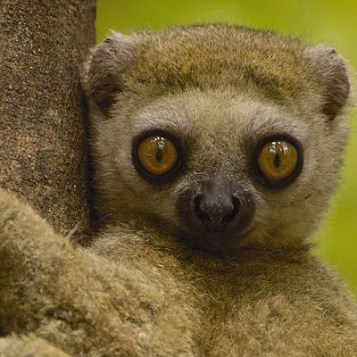

```{r setup, include=FALSE}
options(htmltools.dir.version = FALSE)
knitr::opts_chunk$set(
  fig.retina = 2,
  warning = FALSE,
  message = FALSE
)

library(fontawesome)
library(tidyverse)
```

class: inverse, middle, center



# `r rmarkdown::metadata$author` 

[`r fa_i("wikipedia-w")` Wikipedia](https://en.wikipedia.org/wiki/Bemaraha_woolly_lemur)<br/>
[`r fa_i("twitter")` @DukeLemurCenter](https://twitter.com/DukeLemurCenter)<br/>
[`r fa_i("paper-plane")` avahi@cleesei.com](mailto:avahi@cleesei.com)<br>

???
Hello! My name is Avahi Cleesei and I'm a Bemahara woolly lemur working as a researcher at Bemahara University in Madagascar. I'm excited to be here at useR!2021 to present some data collected by the Duke Lemur Center.

This slide uses:
- the `inverse`, `middle`, and `center` slide classes
- an image inserted with html

---
background-image: url(avahi-cleesei-02.jpg)
background-position: right
background-size: contain

.pull-left[
# The Avahi cleesei lemur

> A species of woolly lemur native to western Madagascar, named after [actor-comedian] John Cleese...mainly because of Cleese's fondness for lemurs...and his efforts at protecting and preserving them.

> This diurnal animal...has brown skin with white regions on the rear and inside of the thighs and has a short damp nose, large plate eyes, and ears which hardly stand out from the skin.


.footnote[
----
- Original source: [Bemahara woolly lemur | Wikipedia](https://en.wikipedia.org/wiki/Bemaraha_woolly_lemur)
- Illustration by [Rachel Hudson](https://lemur.duke.edu/100-lemurs/)
] <!--end of footnote-->

] <!--end of pull left -->

???
This slide uses:
- a background image
- the `.pull-left[]` class
- a horizontal bar
- the `.footnote[]` class
- bullet list with `*`
- quotes with `>`
---

.left-column[
# Making lists
] <!--end of left column -->

.right-column[
Some facts about **lemurs**

1. Lemurs are considered _living fossils_ because they provide key clues about primate evolution

1. Lemurs are endemic to only Madagascar

1. 95% of lemur species are at risk of extinction


.footnote[
----
Original source: [Duke Lemur Center](https://lemur.duke.edu/protect/overview-madagascar-conservation-programs/)
] <!--end of footnote-->

] <!--end of right column -->

???
This slide uses:
- numbered list with `1.`
- a horizontal bar
- the `.footnote[]` class

---
# Inserting images

.pull-left[

## Lemurs are endemic to only Madagascar

.footnote[Image from [Odyssey Travels](https://www.odyssey-travels.com/site/assets/maps/positive/madagascar.png)] <!--end of footnote -->

] <!--end of pull left-->

.pull-right[


] <!--end of pull right -->

???
This slide uses:
- two different heading sizes: `#` and `##`
- an image and accompanying alternative text inserted with ``
- `.pull-left[]` and `.pull-right[]` classes
- the `.footnote[]` class

---
# Tables

The `lemur_data` dataset contains life histories for a variety of lemurs housed at the [Duke Lemur Center](https://lemur.duke.edu/about/history-mission/) in North Carolina, USA.

```{r lemur-births, echo=FALSE}
lemurs <- readRDS("lemurs.rds")

lemurs %>%
  arrange(desc(age_at_wt_y)) %>%
  head() %>%
  knitr::kable(format = 'html')
```

.footnote[
Data source: [Duke Lemur Center Data | Kaggle](https://www.kaggle.com/jessemostipak/duke-lemur-center-data)
] <!--end of footnote-->

???
This slide uses:
- an R code chunk to produce the HTML table
- the `.footnote[]` class

---
# Highlighting code

`> Inline code is differentiated by a monospace font face`

You can highlight lines of code within code chunks using `#<<` which adds a yellow background:

### Code

```r
lemurs %>% filter(birth_type != "unknown") %>%
  ggplot(aes(x = dob, fill = birth_type)) +
  geom_histogram() +              #<<
  minimal_theme()
```

### Output

```{r eval=FALSE, echo=TRUE}
lemurs %>% filter(birth_type != "unknown") %>%
  ggplot(aes(x = dob, fill = birth_type)) +
  geom_histogram() +               #<<
  minimal_theme()
```

???
This slide uses:
- inline code highlighting with backticks ` `` `
- a code chunk to produce a ggplot

---

```{r, eval=TRUE, echo=TRUE, fig.height=6.5, fig.width=14, fig.alt="Histogram of unique lemur births between 1975 and 2019 showing more births took place in captivity than in the wild, with most births concentrated between 1975 and 2000. Births in the wild peaked near 1985 at almost 300 births and again near 2012 at about 100 births. Births in captivity had a plateau between 1980 and 1985 at about 25 births"}
lemurs %>% filter(birth_type != "unknown") %>%
  ggplot(aes(x = dob, fill = birth_type)) +
  geom_histogram() +
  theme_minimal()
```

???
This slide uses:
- a code chunk to produce a ggplot
- code chunk option `fig.height = 6.5` and `fig.width = 14` to control the figure height and width

---
class: middle, inverse

.pull-left[
# Thank you!
<br><br>
## `r rmarkdown::metadata$author`  

### `r rmarkdown::metadata$institute`
] <!--end of pull left -->

.pull-right[
.right[


[`r fa_i("wikipedia-w")` Wikipedia](https://en.wikipedia.org/wiki/Bemaraha_woolly_lemur)<br/>
[`r fa_i("twitter")` @DukeLemurCenter](https://twitter.com/DukeLemurCenter)<br/>
[`r fa_i("paper-plane")` avahi@cleesei.com](mailto:avahi@cleesei.com)
] <!--end of right -->
] <!--end of pull right -->

???
Thank you for joining me!
You can find my contact information linked on this slide if you want to get in touch, and I'm happy to take any questions.

This slide contains
- `.pull-left[]` and `.pull-right[]` classes
- `.right[]` class
