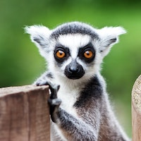

```{r setup, include=FALSE}
knitr::opts_chunk$set(
  fig.width=9, fig.height=4, fig.retina=2, 
  out.width="100%",
  message = FALSE
)
```

class: center middle

🗺 [Introduction to CSS Activity](https://presentable-user2021.netlify.app/materials/act-02/06-css-into/#activity)

---
class: center middle

Lemurs are the most endangered mammals on Earth




---

```{r lemur-weight, fig.show='hide'}
library(tidyverse)
lemurs <- readRDS("lemurs.rds")

lemurs %>%
  filter(
    common_name == "Ring-Tailed Lemur",
    between(age_at_wt_y, 1, 5)
  ) %>%
  ggplot() +
  aes(x = age_at_wt_y, y = weight) +
  geom_point() +
  labs(
    x = "Age at Weight",
    y = "Weight (g)",
    title = "Weight Gain of Young Ring-Tailed Lemurs"
  )
```


